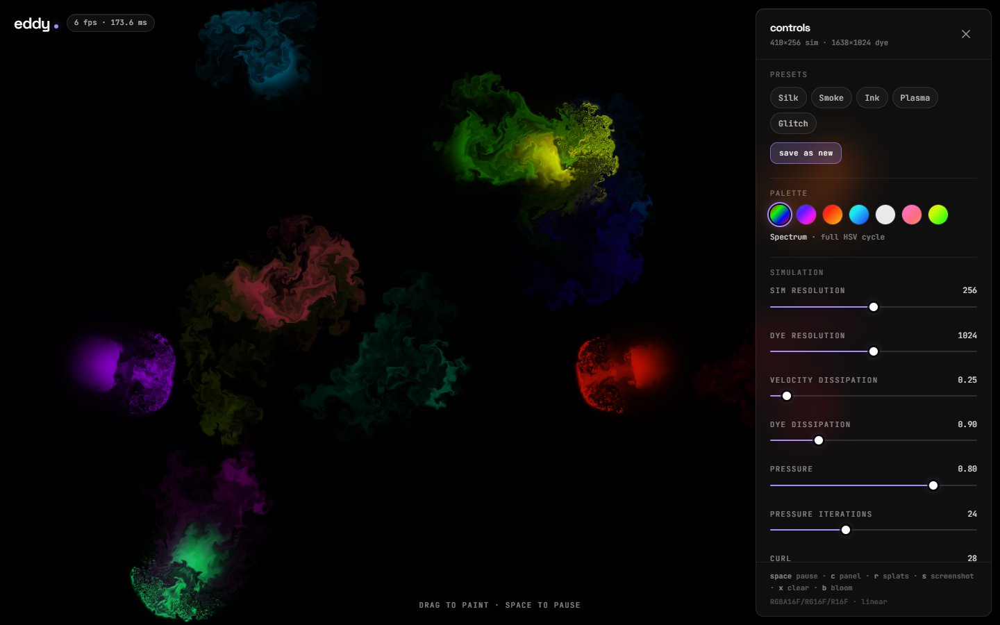

# Eddy

**An interactive WebGL2 fluid playground: paint swirling dye with mouse or touch, tune the flow, and share your favourite look.**

Raw WebGL2 + hand-written GLSL. No Three.js, no fluid libraries: the solver, the shaders, the framebuffer plumbing and the UI are all in this repo.



## Why I built this

I wanted to understand a stable-fluids solver well enough to write every pass myself, on the GPU, in a form that a reader can follow from the maths to the pixels. The interesting engineering is not any single shader; it is the plumbing that joins the passes, bounds each timestep, preserves square cells across viewport shapes, and negotiates renderable texture formats. Eddy is the result: a semi-Lagrangian visual simulation plus a small UI that lets you feel every knob. It is a graphics playground, not a validated scientific fluid model.

## Features

- **Stable-fluids solver on the GPU**: velocity, dye, pressure, divergence and curl live in framebuffers (`RGBA16F`/`RG16F`/`R16F` when renderable, packed 16-bit-in-`RGBA8` fallback otherwise). Updated fields use ping-pong pairs. The fallback clamps signed fields to ±64 and stores dye in 8-bit colour, so it does not reproduce the half-float path exactly. Sim grid (128-512) and dye grid (512-2048) are sized independently of the DPR-aware canvas.
- **Nine-plus fragment programs**: splat (Gaussian), advection (bilinear back-trace + frame-rate-independent dissipation), curl, vorticity confinement, divergence, Jacobi pressure (15-40 sweeps, warm-started), gradient subtraction, bloom prefilter / blur / final, display (height-field shading + ordered dither). Each is a single fullscreen-triangle draw.
- **Multi-touch painting**: Pointer Events tracked by `pointerId`, so several fingers paint at once, each with its own colour. Impulse is proportional to pointer speed; a tap leaves a dot.
- **Colour system**: golden-ratio hue cycling inside seven palettes (Spectrum, Nebula, Ember, Ocean, Mono, Sakura, Acid); long strokes drift slowly through the palette arc. The UI accent follows the palette.
- **Frosted-glass side panel**: sim/dye resolution, velocity and dye dissipation, pressure, pressure iterations, curl, splat radius/force, shading, bloom (intensity + threshold), idle splats, pause. Gradient-track sliders glow in the palette accent. Fully keyboard operable.
- **Presets**: five built-in looks (Silk, Smoke, Ink, Plasma, Glitch) as typed constants, plus save / update / rename / delete of your own, persisted under the `eddy:v1:` namespace in `localStorage`.
- **Random splats and idle mode**: an `r` key / button fires a burst; after three seconds of silence the fluid keeps itself alive (toggleable).
- **Screenshot to PNG** without `preserveDrawingBuffer`: the display pass is re-rendered into a capture FBO and read back with `readPixels`.
- **Audio-reactive mode**: an opt-in microphone `AnalyserNode` (1024-point FFT) measures 40-180 Hz bass energy every frame; bass swells the brush radius and a smoothed-history onset detector fires splats on every beat. Audio never leaves the device.
- **Shareable links**: the "share link" button encodes the current settings as base64url in the URL hash (`#s=...`); opening it reproduces the look.
- **HUD and fallbacks**: fps / frame-time pill, draw-call and format read-out, context-loss recovery, and a proper "WebGL2 not supported" state.

Keyboard: `space` pause · `c` panel · `r` splats · `s` screenshot · `x` clear · `b` bloom · `m` microphone · `Esc` close.

## How it works

### One frame

```mermaid
flowchart LR
    subgraph input[Input]
        P[Pointer strokes<br/>idle bursts] --> S
    end
    subgraph sim["Simulation (sim grid, half-float)"]
        S[splat<br/>velocity + dye] --> AV[advect velocity]
        AV --> C[curl]
        C --> V[vorticity<br/>confinement]
        V --> D[divergence]
        D --> W[warm-start<br/>pressure × p]
        W --> J[Jacobi × N<br/>ping-pong]
        J --> G[gradient<br/>subtract]
    end
    G --> AD[advect dye<br/>dye grid]
    subgraph post["Post (bloom pyramid)"]
        AD --> BP[bright pass]
        BP --> BD[3× downsample blur]
        BD --> BU[3× additive upsample]
        BU --> BF[final tone]
    end
    AD --> DISP
    BF --> DISP[display<br/>shading + dither<br/>canvas or capture FBO]
```



```
 splat ─▶ advect v ─▶ curl ─▶ vorticity ─▶ divergence ─▶ [pressure × p] ─▶ Jacobi ×N ─▶ ∇p subtract ─▶ advect dye ─▶ (bloom) ─▶ display
         ╰────────────────────────── sim grid, RG16F / R16F ──────────────────────────╯   ╰─ dye grid ─╯  ╰ ¼ res ╯  ╰ canvas ╯
```

The descriptive pass list lives in `src/gl/pipeline.ts`; `FluidSim.step()` implements the sequence explicitly. Unit tests check the descriptive list and shader assembly, not the actual GPU draw sequence. Changes to either need a matching review of the runtime and this diagram.

### The solver, pass by pass

| Pass | Program | What it does |
| --- | --- | --- |
| splat | `splat.ts` | Adds a Gaussian blob of velocity (into the field) and colour (into dye). Distance is measured in world units (short viewport side = 1), so splats are circles on any aspect. |
| advect | `advection.ts` | Semi-Lagrangian: for each cell, trace back `dt · v` and bilinearly sample where the material came from. Interpolation does not create new extrema, but introduces numerical diffusion and is not mass-conserving. Multiplies by `exp(-dissipation · dt)` using the bounded simulation timestep. Compiled twice: once for the vec2 velocity field, once for RGB dye. |
| curl | `curl.ts` | `ω = ∂v/∂x − ∂u/∂y` by central differences. |
| vorticity | `vorticity.ts` | Fedkiw-style confinement: `N = ∇|ω| / ‖∇|ω|‖`, force `ε · (N × ω)`, pushes energy back into the small eddies that numerical diffusion smears out. |
| divergence | `divergence.ts` | `∇·v` with mirrored-normal walls at the viewport edge, so fluid never leaves the screen. |
| clear | `clear.ts` | Scales last frame's pressure by the `pressure` knob as a warm start. Its benefit depends on how the field changes; a fixed iteration count is not an accuracy guarantee. |
| pressure | `pressure.ts` | One Jacobi relaxation of `∇²p = ∇·v`: `p = (pL + pR + pB + pT − div) / 4`, ping-ponged N times. `CLAMP_TO_EDGE` gives the Neumann wall condition for free. |
| gradientSubtract | `gradientSubtract.ts` | `v −= ∇p`, leaving an (approximately) divergence-free field. |
| bloomPrefilter / bloomBlur / bloomFinal | `bloom*.ts` | Soft-knee bright pass at ¼ dye resolution, a 4-level 3×3 tent pyramid walked down then back up with additive blending, then a Reinhard-style roll-off. |
| display | `display.ts` | Samples dye, optionally treats its luminance as a height field and lights it, adds bloom, applies a hash-based ordered dither so 8-bit blacks do not band. |

The `FRAGMENT_PREAMBLE` (`shaders/common.ts`) is prepended to every pass and hides two hardware differences from the physics: how signed fields are *encoded* (raw half floats vs. two-byte fixed point packed into `RGBA8`) and how they are *sampled* (hardware `LINEAR` vs. a 4-tap shader reconstruction). The pass bodies only ever call `readVec2 / writeVec2 / sampleColor`, so the solver is written once.

### Framebuffers and formats

- `FBO` wraps a texture + framebuffer and carries its own `texelX / texelY`; every draw sets the `u_texelSize` uniform from the *target*, and the vertex shader hands the fragment stage its four axis neighbours so stencil passes never recompute them.
- `DoubleFBO` is the ping-pong pair with `read`, `write` and `swap()`. Textures cannot be sampled and rendered at the same time, so every in-place update (advect, vorticity, Jacobi, projection, splat) goes through one.
- `negotiateFormats()` asks for `EXT_color_buffer_float`, then *actually tries* to attach `RGBA16F`, `RG16F` and `R16F` textures to a framebuffer and checks completeness (some ANGLE/D3D stacks expose the extension but still refuse `RG`/`R`). It falls back format by format, and to packed `RGBA8` when nothing floats. Half-float `LINEAR` filtering is core in WebGL2, so the manual bilinear path stays in reserve for buggy drivers.
- Resolution is decoupled from the canvas: `computeGridSize(base, w, h)` puts `base` cells on the *short* side and scales the long side so cells stay square; velocity lives on the 256 grid, dye on the 1024 grid, display on the DPR-capped canvas. Changing a resolution resamples the live fluid into the new textures instead of wiping it.

### Everything around the solver

- `src/core/` is pure TypeScript with no DOM or WebGL: colour maths, palettes, the golden-ratio `ColorCycler`, preset (de)serialisation and sanitising, grid sizing, FFT band energy and beat detection, and a CPU `ReferenceFluid` model of the numerical operations. It uses Float32 arrays and texel-space velocities; the GPU uses world-space velocities, separate dye resolution, and negotiated texture precision. CPU tests are not GPU parity tests.
- `PointerTracker` accumulates each pointer's displacement between frames; the render loop drains it once per frame into splats with impulse `Δx / dt · splatForce / 60`.
- Zustand holds settings/presets (persisted) and runtime stats (published at 2 Hz so the HUD does not re-render at 60 Hz). The React tree never re-renders on the animation loop.

### Numerical and hardware limits

Each GPU step clamps elapsed time to at most `1/30` second without catch-up substeps. Below 30 rendered frames per second, simulated time advances more slowly than wall-clock time. Semi-Lagrangian transport is dissipative, and the fixed Jacobi solve only reduces divergence approximately; the CPU projection tests cover selected inputs, not all flows or GPU formats. Packed fields can saturate at ±64. Grid sizes follow aspect ratio but are not capped against the device's texture-size or memory limits, so extreme settings can fail allocation.

## Historical performance measurements

The figures below are historical measurements recorded for this repository, not results remeasured by the current unit-test/build checks. The original notes describe headless Edge, 3 s per preset with continuous synthetic dragging, and an **Intel UHD integrated GPU** shared with other build jobs. Browser compositing, background load, device, settings, and driver all affect these numbers. They are not a 60 fps guarantee or a lower bound for other hardware.

| 1280 × 720, Intel UHD (ANGLE D3D11) | fps | mean ms | median ms |
| --- | ---: | ---: | ---: |
| paused (display + bloom + compositing only) | 122 | 8.2 | — |
| Silk (256 sim · 1024 dye · 30 Jacobi · bloom) | 51 | 19.7 | — |
| Smoke (256 · 1024 · 20 · no bloom) | 70 | 14.2 | — |
| Ink (256 · 1024 · 36 · no bloom) | 61 | 16.4 | — |
| Plasma (256 · 1024 · 26 · bloom 1.1) | 35 | 29.0 | — |
| Glitch (128 · 512 · 15 · bloom) | 43 | 23.5 | — |

| 1920 × 1080, same GPU | fps | mean ms | median ms |
| --- | ---: | ---: | ---: |
| paused | 71 | 14.2 | 13.9 |
| Silk | 45 | 22.1 | 20.9 |
| Smoke | 55 | 18.3 | 20.4 |
| Ink | 55 | 18.2 | 14.4 |
| Plasma | 32 | 30.8 | 22.1 |
| Glitch | 125 | 8.0 | 7.0 |

Historical per-frame workload estimates at 1080p from `npm run bench` (not measured GPU durations):

| preset | sim grid | dye grid | Jacobi | draw calls | Mtexels / frame |
| --- | --- | --- | ---: | ---: | ---: |
| Default | 455 × 256 | 1820 × 1024 | 24 | 40 | 7.7 |
| Silk | 455 × 256 | 1820 × 1024 | 30 | 46 | 8.4 |
| Smoke | 455 × 256 | 1820 × 1024 | 20 | 28 | 7.0 |
| Ink | 455 × 256 | 1820 × 1024 | 36 | 44 | 8.8 |
| Plasma | 455 × 256 | 1820 × 1024 | 26 | 42 | 8.0 |
| Glitch | 228 × 128 | 910 × 512 | 15 | 31 | 3.5 |

One historical tuning observation: WebGL2 makes half-float linear filtering core, while most implementations do not list the WebGL1 `OES_texture_half_float_linear` extension string. Treating that missing string as "no linear filtering" selected the 4-tap shader-bilinear path. The original measurements reported a paused 720p baseline changing from 82 to 122 fps and Smoke from 51 to 70 fps after correcting negotiation; that comparison has not been revalidated here.

Historical CPU model timings (`npm run bench`, Node 26, single thread), included to illustrate the relative cost of each stage rather than predict GPU performance:

| grid (16:9) | advect v | curl | vorticity | divergence | 1 Jacobi | ∇p | advect dye | full step (24 Jacobi) |
| --- | ---: | ---: | ---: | ---: | ---: | ---: | ---: | ---: |
| 114 × 64 | 0.31 ms | 0.05 | 0.29 | 0.05 | 0.12 | 0.12 | 0.79 | 3.7 ms |
| 228 × 128 | 1.07 | 0.26 | 1.61 | 0.26 | 0.72 | 0.47 | 2.84 | 13.6 ms |
| 455 × 256 | 3.35 | 0.93 | 3.74 | 1.41 | 1.53 | 0.92 | 5.19 | 44.0 ms |

The historical CPU timings put substantial work in the Jacobi loop. Lowering resolution or `pressureIterations` reduces work, but also changes the result. Measure the actual browser/device workload before choosing settings; these tables do not establish a per-frame GPU or TypeScript timing budget.

## Run, test, bench

```bash
npm ci
npm run dev        # Vite dev server
npm run build      # tsc -b (strict) + vite build -> dist/
npm run preview    # serve dist/
npm test           # vitest: core, format decisions, shader assembly, store and mocked audio lifecycle
npm run lint       # oxlint
npm run bench      # CPU reference solver + per-preset GPU work table
```

Tests cover: preset serialisation round-trips (property-based), HSV↔RGB, palette arcs, splat colour cycling, grid/aspect sizing and DPR canvas sizing, the format-negotiation decision tree, the descriptive pass order and shader assembly, multi-pointer tracking by `pointerId`, `localStorage` persistence under the `eddy:` namespace, bass-band / onset detection, mocked microphone cancellation and cleanup, and the CPU model (projection reduces divergence for the tested input, dissipation drains energy, confinement adds it, curl of a rigid rotation is uniform). They do not compile GLSL on a live GPU or exercise real microphone permission dialogs.

`scripts/measure-fps.mjs` and `scripts/check-fallback.mjs` are historical Windows-only helpers, not portable checks installed by `npm ci`: they reference an external Playwright installation and a fixed Edge path. Their cleanup also terminates the process listening on the selected port. Review and adapt those helpers before running them; neither is part of `npm test` or `npm run build`.

Open `/#panel` to load with the controls open; `/#s=<base64url>` loads shared settings.

## Deploy to Vercel

```bash
npm i -g vercel
vercel            # framework auto-detected as Vite; vercel.json adds the SPA rewrite and immutable asset caching
```

Or import the repository in the Vercel dashboard; no environment variables are required. The app is a single static page and works from any static host.

## Inspired by

- **Pavel Dobryakov's [WebGL Fluid Simulation](https://paveldogreat.github.io/WebGL-Fluid-Simulation)**: the idea of a full-screen fluid you paint by dragging, with bloom and a small tweak panel, comes straight from there. The solver, shaders, framebuffer abstraction and UI here are written from scratch and differ in structure (single fullscreen triangle, per-pass texel-size varyings, world-unit splats, format probing with an `RGBA8` packed fallback, warm-started Jacobi, height-field shading).
- Jos Stam, *Stable Fluids* (1999) and *Real-Time Fluid Dynamics for Games* (2003) for the semi-Lagrangian scheme and the projection step.
- Mark Harris, *Fast Fluid Dynamics Simulation on the GPU* (GPU Gems, 2004) for the GPU formulation.
- Fedkiw, Stam and Jensen, *Visual Simulation of Smoke* (2001) for vorticity confinement.

## License

[MIT](LICENSE) © 2026 Jafn
